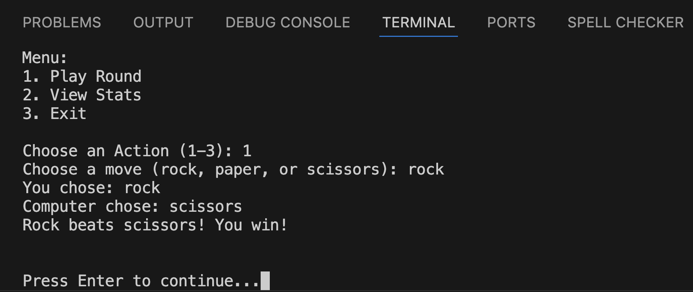

# Project Overview

This project is a simple command-line task manager where users can play rounds and view statistics. The application stores game data (wins, losses, and ties) in an array of objects, provides user options through prompts, and uses array methods to compute statistics.

## Key Features & Usage Example
After running the application, the user is presented with a menu of options. They can:
1. Play a round of Rock Paper Scissors against the computer
2. View game statistics (wins, losses, ties, total games played, and win rate)
3. Exit the application

In the screenshot below, you can see a user selecting the "Play Round" option and entering a move "rock".



## Setup

Follow these steps to get started:

```sh
# Clone the repo
git clone https://github.com/evu725/swe-project-1-cli-app.git
cd swe-project-1-cli-app

# Install dependencies
npm install

# Run the src/index.js file
node src/index.js

# Or, you can use the start command shortcut
npm start

# Or, run in developer mode using nodemon
npm run dev
```

## Key Technologies & Packages

* Node
* `prompt-sync`